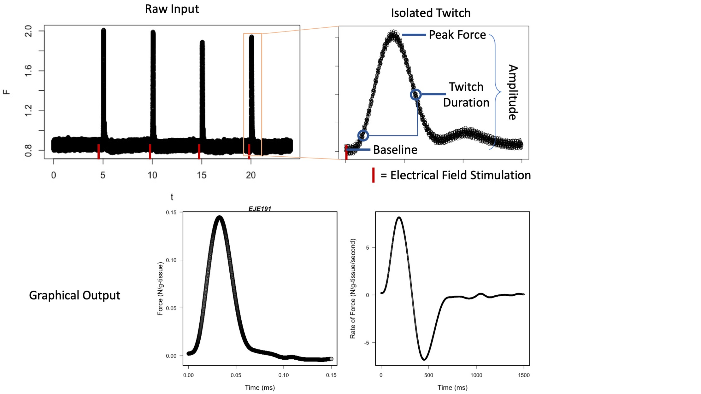
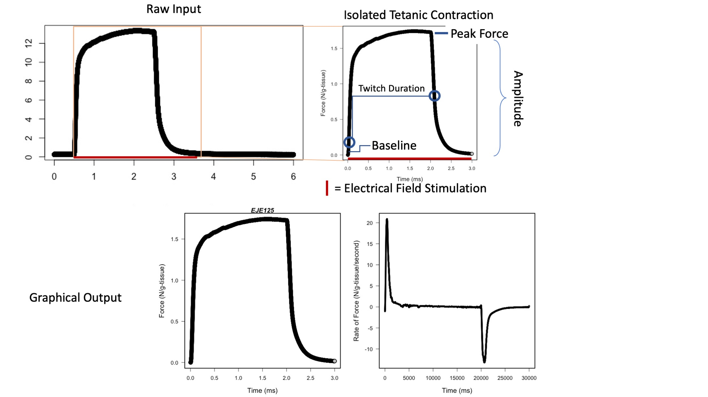
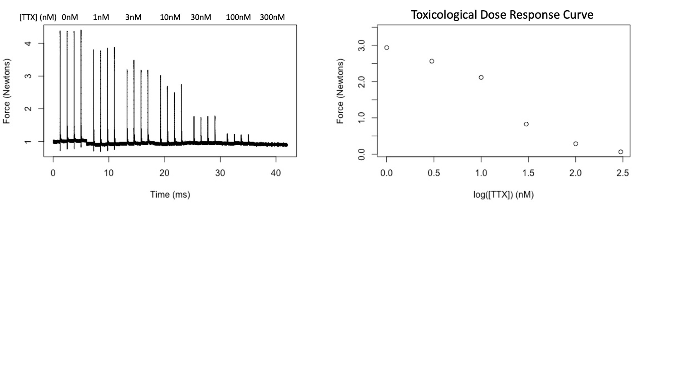
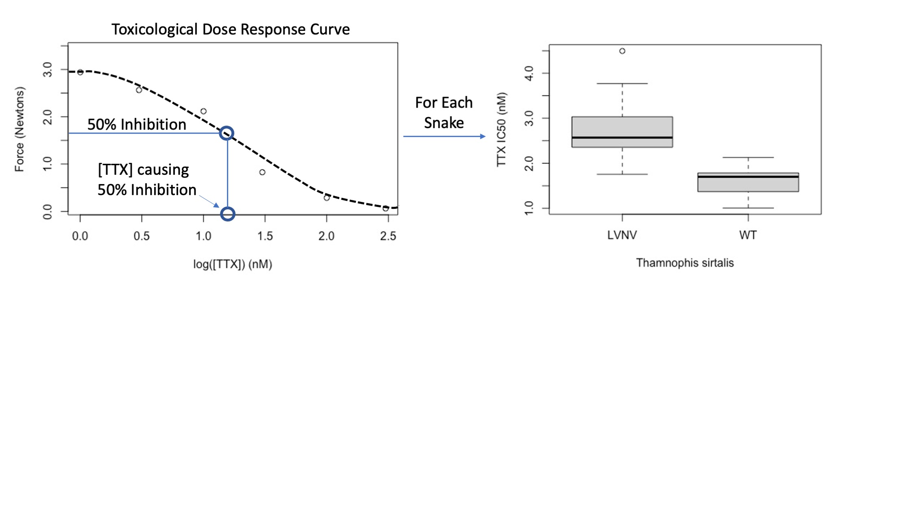

# Skeletal Muscle Force Analysis Code Suite

------------------------------------------------------------------------

## Author

These codes were written by Dr. Robert Eugene del Carlo to analyse physiological and toxicological data pertinent to his doctoral dissertation and subsequent peer review publications.

------------------------------------------------------------------------

## Primer on Codes Included Here

The pipeline of four codes here takes comma separated data representing skeletal muscle twitches and tetanic force output.

Code 1 analyzes skeletal muscle twitches, calculating key metrics of performance, such as peak force and duration of twich, and metrics of the the first derivative.

Code 2 analyzes skeletal muscle tetanus, calculating the maximum force generated, speed of force generation and relaxation, and first derivatives.

Code 3 extracts skeletal muscle twitch forces that occurred in the presence of a given concentration of the neurotoxin, Tetrodotoxin (in the nanomolar range).

Code 4 takes the output of Code 3 and fits these series of concetration-force pairs to Boltzmann sigmoidal curves, reporting key parameters for the shape of each curve.

These scripts are intended to be run sequentially, but it is not necessary to run each. These scripts were written so that the output at each step could be generated and checked for quality control by hand prior to subsequent analysis. These scripts were used to process and analyze data relevant to the following paper: ["Functional Constraints on Sodium Ion Channels Limit Adaptive Evolution", del Carlo et al., 2022.](https://github.com/rdelcarlo/Snake_Biophysical_Trade-off)

------------------------------------------------------------------------

## Scripting Conditions

R Version R 4.2.0
These codes were drafted on a Windows machine and have since been tooled to work for a Mac OS (Monterey).

If you are running these codes on a MacOS device, you may need to run:

```bash
xcode-select --install
```

from the command line and install its dependencies, especially for code04.

These codes require the following databases to properly execute the analyses:

    SnakeInfo-09.30.2020.csv
    SnakeSkeletalMuscleMasses-9.28.2020.csv

For the purposes of this demo, only animals included in the demo data have been included in these databases.

------------------------------------------------------------------------

## Filename Requirements

Each of these codes requires that the input files be in comma-separated value (CSV) format. There are external softwares for converting *.dat* files to.csv. All codes require that the filenames put necessary information in a specific order, separated by hyphens, in order to properly parse relevant data. For example, Code 1 requires files be named in the following convention: SnakeID-MuscleNumber-Protocol.*dat.csv*, e.g.

    CRF2680-M1-C4P1.dat.csv

In this format, the filename indicates that this four-pulse control (C4P) experiment was performed on the first muscle (M1) dissected from the 2680th animal collected by Chris R. Feldman (CRF).

Code 2, similarly requires files in a similar format (SnakeID-MuscleNumber-Protocol.dat.CSV), such as

    REdC11-M1-Tetanus2.dat.csv

This filename indicates that the tetanus protocol eliciting force via a sustained, two second, electrical stimulus, was performed on the first muscle dissected from the 11th animal collected by Robert Eugene del Carlo (REdC).

Code 3 requires a similar filename format. Uniquely, however, each SnakeID will necessarily have many associated files in this dataset as each muscle was tested at several different concentrations of tetrodotoxin (TTX). The filename format is SnakeID-MuscleNumber-TTXConcentration.*dat.csv*, such as

    REdC7-M2-TTX01.dat.csv
    REdC7-M2-TTX11.dat.csv
    REdC7-M2-TTX31.dat.csv
    REdC7-M2-TTX101.dat.csv
    REdC7-M2-TTX301.dat.csv
    REdC7-M2-TTX1001.dat.csv
    REdC7-M2-TTX3001.dat.csv
    REdC7-M2-TTX10001.dat.csv
    REdC7-M2-TTX30001.dat.csv
    REdC7-M2-TTX70001.dat.csv
    REdC7-M2-TTX100001.dat.csv
    REdC7-M2-TTX200001.dat.csv
    REdC7-M2-TTX300001.dat.csv
    REdC7-M2-TTX400001.dat.csv
    REdC7-M2-TTX500001.dat.csv
    REdC7-M2-TTX600001.dat.csv
    REdC7-M2-TTX700001.dat.csv
    REdC7-M2-TTX800001.dat.csv
    REdC7-M2-TTX900001.dat.csv
    REdC7-M2-TTX1000001.dat.csv

In this case, the filenames suggest that the second muscle dissected from the 7th animal collected by REdC was subjected to 20 increasing concentrations of Tetrodotoxin (TTX) with a control experiment at 0 nanomolar (REdC7-M2-TTX01.*dat.csv*) increasing in semilogarithmic fashion from 1 nanomolar (REdC7-M2-TTX11.*dat.csv*) to 100,000 nM (REdC7-M2-TTX1000001.*dat.csv*) (aka 100 μM). Code three will perform similar steps as Code 1 on each of these files and summarize their key metrics in columns where each column corresponds to a single muscle from a single snake, while each subsequent row corresponsed to the force generated by that snake's muscle at a specific TTX concentration (all forces reported in a row were subjected to the same concentration of TTX).

Code 4 simply requires the output from Code 3 without changes to format. Based on your notes from each experiment, you can open the output from Code 3, specifically the file named

    p4C4PwithTTX-ContrAmpl.N.g..csv

and edit each column as needed. Appropriate edits might include: basal tension offsets manually recorded at the time of the experiment, setting supernumary values to a given maximum to force sigmoidal fitting, or adding artificial zero-values at excessive doses to allow the sigmoidal fitting routine to appropriately capture the biological data.

------------------------------------------------------------------------

## Support

You can reach the corresponding author of this script at: [rdelcarlo\@med.unr.edu](mailto:rdelcarlo@med.unr.edu)

------------------------------------------------------------------------

# Demo Dataset

The data in this demo dataset covers 40 snakes from two species, each of which contains a TTX-sensitive or a TTX-resistant sodium channel allele.

The snakes in this dataset are named: CRF3111 CRF3112 CRF3605 CRF3606 CRF3607 CRF3608 CRF3609 CRF3610 CRF3611 CRF3613 CRF3614 CRF3615 CRF3617 CRF3618 CRF3619 CRF3620 CRF3621 EJE125 EJE126 EJE190 EJE191 JSR012 JSR013 JSR037 MTJH390 MTJH394 MTJH399 MTJH402 MTJH430 REdC1 REdC10 REdC11 REdC2 REdC3 REdC4 REdC5 REdC6 REdC7 REdC8 REdC9

Data on these snakes can be found in the datasets below:

    SnakeInfo-09.30.2020.csv
    SnakeSkeletalMuscleMasses-9.28.2020.csv

These datasets are required to run these codes for accurate results.

The sample includes 4.41 GB of data comprising 510 files.

------------------------------------------------------------------------

## Graphical Summary Processing

### Code 1


### Code 2


### Code 3


### Code 4


------------------------------------------------------------------------
